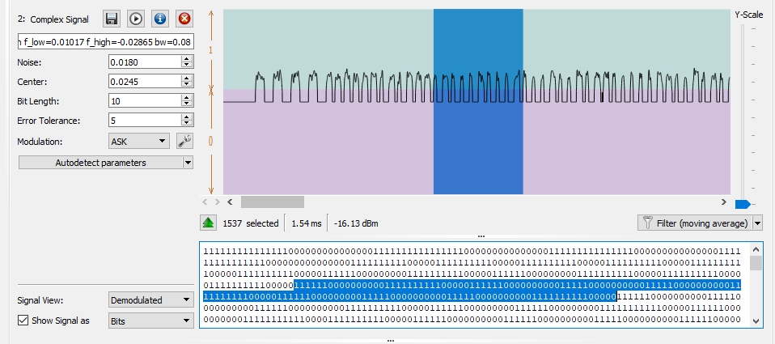
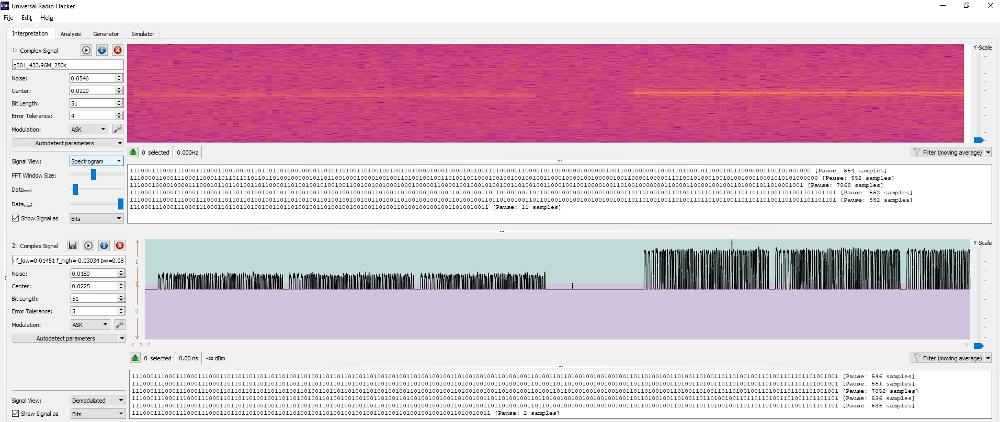
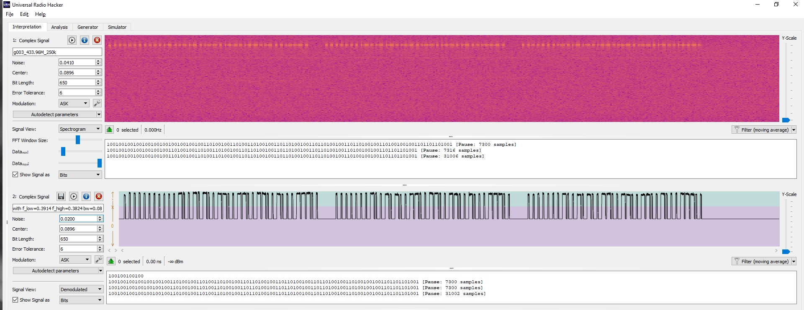
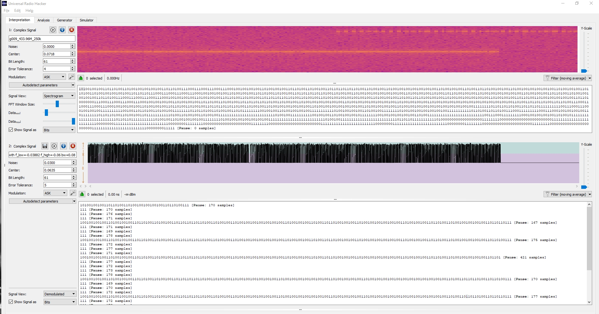
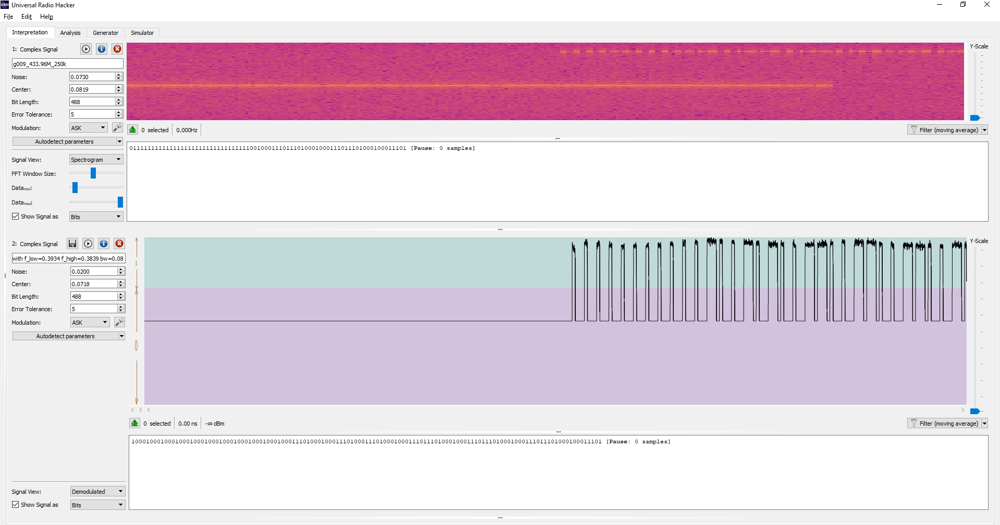

# Manually Decoding ASK PWM Signals from rtl_433 Signal I/Q Sample Files using Universal Radio Hacker
[https://groups.google.com/d/msg/rtl_433/TpeXelyqgkM/OezRawSjAgAJ](https://groups.google.com/d/msg/rtl_433/TpeXelyqgkM/OezRawSjAgAJ)

	From: "Garfield .15.99"
	To: rtl_433 <rtl_433@googlegroups.com>
	Date: Thu, 17 Jan 2019 20:07:47 -0800 (PST)
	Subject: [rtl_433] Please look at 3 samples
	Message-Id: <40598251-0e34-42ab-9d63-d9b8526efbe8@googlegroups.com>

	Trying to find something that is similar to Hideki Electronic. I have 
	installed sigrok and pulseview to both a linux and a windows 10 computer, 
	but I don't how to use either of them. Thanks Garfield.

	Attachments:
	- g001_433.96M_250k.cu8
	- g003_433.96M_250k.cu8
	- g009_433.96M_250k.cu8

## Here's my process for doing this sort of thing.

I like to use [Universal Radio Hacker](https://github.com/jopohl/urh) instead of sigrok/pulseview to do a
first analysis on these kinds of signals.

To easily load these signal files in URH, rename them as `.complex16u` files.

- [g001_433.96M_250k.complex16u](g001_433.96M_250k.complex16u)
- [g003_433.96M_250k.complex16u](g003_433.96M_250k.complex16u)
- [g009_433.96M_250k.complex16u](g009_433.96M_250k.complex16u)

Load the `g001_433.96M_250k.complex16u` file into URH.  Change the Signal View to "Spectrogram" and you can see it looks like two signals.  Each is at a frequency
slightly different than the other.  The signals appear to be "ASK" modulated.

Select just the frequency of the signal in this view, right-click on your selection, and choose "Apply bandpass filter".  It'll create a new view.

In this new view, you should be looking at the "Analog" Signal View.  We first need to figure out a value for "Noise".  By trying different values, you'll find a value of `0.0180`
seems to just encapsulate the background noise.

We now need to figure out the "Center" value.  Make sure the Modulation is set to "ASK".  Change the Signal View to "Demodulated" and you should
see a square wave representation of the signal.  You can use the mouse to drag the horizontal dividing line between the top light-blue "1" half and the
purplish "0" half down to the midpoint of the wave we want to analyze.  If the waves are too short in height, you can make a guess, slide up 
the "Y-Scale" a bit, and fine tune.

Now we need to figure out the "Bit Length" and "Error Tolerance" values.  This takes a little practice.  Here's what I do.

Zoom in on the wave a bit until you can see around 40 or so full waves on your screen.

If using "ASK" modulation, click on the wrench icon next to that selection and make sure the Pause Threshold is "0" (disabled) for now.

Change the Bit Length to something short, like maybe 10 or so and the Error Tolerance to 5.  You should now see a long line of 1's and 0's under the demodulated wave.



Beginning at a transition of 0's to 1's, select the binary digits until you have exactly 10 full waves selected. The selection should
also end at a transition of 0's to 1's.  Just between the signal wave view and digit view, URH will tell you how many samples are selected.

In this case, I see 1537 selected.  1/10th of this gives us a period length of about 154 samples.  You should be able to visually
determine how many equal symbol width parts make up a period.  It's at least 2, and more likely 3 or 4 for most signals.  In
this case, it looks like each period is 3 symbols wide, so dividing 153 by 3 gives us a bit length for each symbol of about 51.

Change the Bit Length to "51" and the data should look right.  Highlight some binary values and they should exactly match same-sized
parts of each wave.  Change the Error Tolerance to roughly 10% of this Bit Length value.

If you notice a longer string of 0's between repetitions of the frame data, you can go back and set the Pause Threshold
to this value to have URH break up frames of data.


### g001_433.96M_250k




This looks like two separate signal bursts, each from a different but similar device. Bursts are at slightly different frequencies, and second burst seems at a higher power.  Both bursts look very similar in format, but data is different.

These signal files were captured at 250k samples per second, so I had to multiply microsecond (μs) values displayed in URH by 4
to get correct values.

#### First signal

Symbol length is 204μs (4902 baud).  Burst contains the same frame sent three times with about 2192μs silence between each frame.
Each frame is 193 symbols, with a preamble of 24 symbols `11100011100011100011100` (presumably for sync) and ends with a single `1` postamble symbol.
Data bits are PWM encoded over three symbols, `100` for a "0" binary value data bit, `110` for a "1" bit.
The 168 symbols of data between preamble/postamble thus decodes to 

	168 symbols / 3 symbols per bit/ 8 bits per byte)
	= 7 bytes
	
In this example, hex data for these bytes: `fd 74 44 4b 06 56 5c`

Then, about 31.4 ms of silence until the next signal.

#### Second signal

Same symbol/data format, but file seems truncated before the end of signal burst
Decoded data in hex is `e6 42 84 cc 06 59 d7`

#### Decoding with [`rtl_433`](https://github.com/merbanan/rtl_433)

Here's my quick tips for creating a flex decoder that works.

- Determine symbol width.  If you have a working "Bit Length" field value in URH and you know the sample rate for your data, 
this value is `bit_length * (1,000,000 / sample_rate)`

- For an PWM signal, I typically pick the short nominal pulse width around 10%-25% less than this, and a long pulse width 
somewhere halfway between that short symbol width value and the width of a long pulse.  By running rtl_433 with the "-a" option, 
it may also correctly guess and tell you what those values should be.

- "gap" and "reset" values depend on what you find in your signal.

- I usually find I need to use the "invert" option to get it to decode the way I'm expecting.

- "preamble" values sometimes help remove unnecessary data from the decoded value.


First signal burst is a little weak, but by manually specifying a signal level, we can pick it up with this flex decoder:

	C:\> rtl_433 -r g001_433.96M_250k.complex16u -R 0 -l 36 -X n=SAMPLE1,m=OOK_PWM,s=180,l=306,g=816,r=3000,invert,preamble={4}f

	Test mode active. Reading samples from file: g001_433.96M_250k.complex16u
	_ _ _ _ _ _ _ _ _ _ _ _ _ _ _ _ _ _ _ _ _ _ _ _ _ _ _ _ _ _ _ _ _ _ _ _ _ _ _ _ _ _ _ _ 
	time      : @0.004492s
	model     : SAMPLE1      count     : 3             num_rows  : 3             rows      :
	len       : 57           data      : fd74444b06565c0,
	len       : 57           data      : fd74444b06565c0,
	len       : 57           data      : fd74444b06565c0
	codes     : {57}fd74444b06565c0, {57}fd74444b06565c0, {57}fd74444b06565c0
	_ _ _ _ _ _ _ _ _ _ _ _ _ _ _ _ _ _ _ _ _ _ _ _ _ _ _ _ _ _ _ _ _ _ _ _ _ _ _ _ _ _ _ _ 
	time      : @0.420832s
	model     : SAMPLE1      count     : 3             num_rows  : 3             rows      :
	len       : 57           data      : ffffffffffffff8,
	len       : 57           data      : ffffffffffffff8,
	len       : 25           data      : ffffff8
	codes     : {57}ffffffffffffff8, {57}ffffffffffffff8, {25}ffffff8


To get at the second signal, specify a different level:

	C:\> rtl_433 -r g001_433.96M_250k.complex16u -R 0 -l 240 -X n=SAMPLE1,m=OOK_PWM,s=204,l=306,g=816,r=3000,invert,preamble={4}f

	Test mode active. Reading samples from file: g001_433.96M_250k.complex16u
	_ _ _ _ _ _ _ _ _ _ _ _ _ _ _ _ _ _ _ _ _ _ _ _ _ _ _ _ _ _ _ _ _ _ _ _ _ _ _ _ _ _ _ _ 
	time      : @0.420856s
	model     : SAMPLE1      count     : 3             num_rows  : 3             rows      :
	len       : 57           data      : e64284cc0659d70,
	len       : 57           data      : e64284cc0659d70,
	len       : 25           data      : e642848
	codes     : {57}e64284cc0659d70, {57}e64284cc0659d70, {25}e642848


#### But wait, doesn't rtl_433 already recognize this signal?

Yes, it does!  We don't even need to create a flex decoder for this signal at all.  rtl_433 already recognizes this one.

	C:\> rtl_433 -r g001_433.96M_250k.complex16u -l 36

	Test mode active. Reading samples from file: g001_433.96M_250k.complex16u
	_ _ _ _ _ _ _ _ _ _ _ _ _ _ _ _ _ _ _ _ _ _ _ _ _ _ _ _ _ _ _ _ _ _ _ _ _ _ _ _ _ _ _ _ _ _ _ _ _ _ _ _ _ _ _ _ _ _ _
	time      : @0.004492s
	model     : Acurite tower sensor                   id        : 15732
	sensor_id : 0x3d74       channel   : A             Temperature: -14.6 C      Humidity  : 75            battery low: 0
	_ _ _ _ _ _ _ _ _ _ _ _ _ _ _ _ _ _ _ _ _ _ _ _ _ _ _ _ _ _ _ _ _ _ _ _ _ _ _ _ _ _ _ _ _ _ _ _ _ _ _ _ _ _ _ _ _ _ _
	time      : @0.004492s
	model     : Acurite tower sensor                   id        : 15732
	sensor_id : 0x3d74       channel   : A             Temperature: -14.6 C      Humidity  : 75            battery low: 0
	_ _ _ _ _ _ _ _ _ _ _ _ _ _ _ _ _ _ _ _ _ _ _ _ _ _ _ _ _ _ _ _ _ _ _ _ _ _ _ _ _ _ _ _ _ _ _ _ _ _ _ _ _ _ _ _ _ _ _
	time      : @0.004492s
	model     : Acurite tower sensor                   id        : 15732
	sensor_id : 0x3d74       channel   : A             Temperature: -14.6 C      Humidity  : 75            battery low: 0
	_ _ _ _ _ _ _ _ _ _ _ _ _ _ _ _ _ _ _ _ _ _ _ _ _ _ _ _ _ _ _ _ _ _ _ _ _ _ _ _ _ _ _ _ _ _ _ _ _ _ _ _ _ _ _ _ _ _ _
	time      : @0.420832s
	model     : Acurite tower sensor                   id        : 9794
	sensor_id : 0x2642       channel   : A             Temperature: -14.3 C      Humidity  : 76            battery low: 1
	_ _ _ _ _ _ _ _ _ _ _ _ _ _ _ _ _ _ _ _ _ _ _ _ _ _ _ _ _ _ _ _ _ _ _ _ _ _ _ _ _ _ _ _ _ _ _ _ _ _ _ _ _ _ _ _ _ _ _
	time      : @0.420832s
	model     : Acurite tower sensor                   id        : 9794
	sensor_id : 0x2642       channel   : A             Temperature: -14.3 C      Humidity  : 76            battery low: 1


### g003_433.96M_250k

This looks like one signal burst, 3 repetitions of the same frame data in the burst.  Symbol length is 2600μs.
Signal burst starts with 12 symbols `100100100100` and immediately goes into first frame.
It looks like each frame is 108 symbols, including a frame sync/preamble of 12 symbols `100100100100`
The remaining 96 symbols could be taken as PWM encoded over three symbols, `100` for a 0 bit, `110` for a 1 bit.
Frames appear to be separated by 24,000μs of silence.

The 96 symbols of data after any sync/preamble decodes to (96 / 3 / 8) 4 bytes.



In this example, hex data is: `12 99 99 1c`

	C:\> rtl_433 -r g003_433.96M_250k.complex16u -R 0 -l 230 -X n=SAMPLE2,m=OOK_PWM,s=1300,l=3900,g=8000,r=40000,invert

	Test mode active. Reading samples from file: g003_433.96M_250k.complex16u
	_ _ _ _ _ _ _ _ _ _ _ _ _ _ _ _ _ _ _ _ _ _ _ _ _ _ _ _ _ _ _ _ _ _ _ _ _ _ _ _ _ _ _ _ 
	time      : @0.008472s
	model     : SAMPLE2      count     : 3             num_rows  : 3             rows      :
	len       : 40           data      : 001299991c,
	len       : 36           data      : 01299991c,
	len       : 36           data      : 01299991c
	codes     : {40}001299991c, {36}01299991c, {36}01299991c


#### But wait, doesn't rtl_433 already recognize this signal too?

Sure does!

	C:\install\SDR\rtl433_build\rtl_433-master\bin>rtl_433 -r g003_433.96M_250k.complex16u -l 230

	Test mode active. Reading samples from file: g003_433.96M_250k.complex16u
	_ _ _ _ _ _ _ _ _ _ _ _ _ _ _ _ _ _ _ _ _ _ _ _ _ _ _ _ _ _ _ _ _ _ _ _ _ _ _ _ _ _ _ _ _ _ _ _ _ _ _ _ _ _ _ _ _ _ _
	time      : @0.008472s
	model     : Philips outdoor temperature sensor     Channel   : 1             Temperature: 11.4 C       Battery   : OK


### g009_433.96M_250k

There seems to be two separate dissimilar overlapping signals in this capture, each on a different frequency.  The first signal seems to be missing the beginning and second seems to be truncated.

By applying a bandpass filter on each signal, decoding is possible.

#### First signal



ASK/OOK, symbol length is 246μs, PWM over 3 symbols.  Data frames are 192 symbols.  (192 / 3 / 8 = 8 bytes).  Frames are (presumably) repeated 5 times each in a grouping.
Data bits are PWM encoded over three symbols, `100` for a 0 bit, `110` for a 1 bit.
Frames have a sync/prefix of 24 symbols `111000111000111000111000`.

Immediately following each 8-byte data frame is a 3-symbol bit value which seems to vary sometimes for an unknown reason.
It seems after a group of 5 repetitions of this sync/frame/bit, is a 5 symbols of "00000".

This seems to be the signal:

```
	signal file begins inside first group
	                                                 100011010000011 0 (0x---missing---?83 + 0b0)
	0000100011010011111010010000000100010110001000000100011010000011 1 (0x08d3e90116204683 + 0b1)
	0000100011010011111010010000000100010110001000000100011010000011 0 (0x08d3e90116204683 + 0b0)
	0000100011010011111010010000000100010110001000000100011010000011 0 (0x08d3e90116204683 + 0b0)
	[new grouping]
	0000100011010011111010010000001000000010000100000000000010111011 0 (0x08d3e902021000bb + 0b0)
	0000100011010011111010010000001000000010000100000000000010111011 1 (0x08d3e902021000bb + 0b1)
	0000100011010011111010010000001000000010000100000000000010111011 0 (0x08d3e902021000bb + 0b0)
	0000100011010011111010010000001000000010000100000000000010111011 0 (0x08d3e902021000bb + 0b0)
	0000100011010011111010010000001000000010000100000000000010111011 0 (0x08d3e902021000bb + 0b0)
```

rtl_433 can find and decode a lot of this signal even though it's missing the beginning and has an overlapping signal near the end.

	C:\> rtl_433 -r g009_433.96M_250k.complex16u -R 0  -l 160 -X n=SAMPLE3,m=OOK_PWM,s=184,l=308,g=650,r=1000,invert,bits=66

	Test mode active. Reading samples from file: g009_433.96M_250k.complex16u
	_ _ _ _ _ _ _ _ _ _ _ _ _ _ _ _ _ _ _ _ _ _ _ _ _ _ _ _ _ _ _ _ _ _ _ _ _ _ _ _ _ _ _ _ _ _ _ _ _ _ _ _ _ _ _ _ _ _ _ _ _ _ _ _ _ _ _ _ _ _ _ _ _ _ _ _ _ _ _ _ _ _ _ _ _ _ _ _ _ _ _ _ _ _ _ _ _ _ _ _ _ _ _ _ _ _ _ _ _ _ _ _ _ _ _ _ _
	time      : @0.004248s
	model     : SAMPLE3      count     : 2             num_rows  : 13            rows      :
	len       : 11           data      : 41a,
	len       : 1            data      : 8,
	len       : 1            data      : 8,
	len       : 1            data      : 8,
	len       : 66           data      : 08d3e90116204683c,
	len       : 1            data      : 8,
	len       : 1            data      : 8,
	len       : 1            data      : 8,
	len       : 66           data      : 08d3e901162046834,
	len       : 1            data      : 8,
	len       : 1            data      : 8,
	len       : 1            data      : 8,
	len       : 65           data      : 08d3e901162046830
	codes     : {11}41a, {1}8, {1}8, {1}8, {66}08d3e90116204683c, {1}8, {1}8, {1}8, {66}08d3e901162046834, {1}8, {1}8, {1}8, {65}08d3e901162046830
	_ _ _ _ _ _ _ _ _ _ _ _ _ _ _ _ _ _ _ _ _ _ _ _ _ _ _ _ _ _ _ _ _ _ _ _ _ _ _ _ _ _ _ _ _ _ _ _ _ _ _ _ _ _ _ _ _ _ _ _ _ _ _ _ _ _ _ _ _ _ _ _ _ _ _ _ _ _ _ _ _ _ _ _ _ _ _ _ _ _ _ _ _ _ _ _ _ _ _ _ _ _ _ _ _ _ _ _ _ _ _ _ _ _ _ _ _
	time      : @0.004248s
	model     : SAMPLE3      count     : 1             num_rows  : 16            rows      :
	len       : 1            data      : 8,
	len       : 1            data      : 8,
	len       : 1            data      : 8,
	len       : 1            data      : 8,
	len       : 66           data      : 08d3e902021000bb4,
	len       : 1            data      : 8,
	len       : 1            data      : 8,
	len       : 1            data      : 8,
	len       : 65           data      : 08d3e902021001ef8,
	len       : 1            data      : 8,
	len       : 51           data      : 969d2908480da,
	len       : 1            data      : 8,
	len       : 1            data      : 8,
	len       : 43           data      : 0f4d2488416,
	len       : 1            data      : 8,
	len       : 35           data      : 09e52023c
	codes     : {1}8, {1}8, {1}8, {1}8, {66}08d3e902021000bb4, {1}8, {1}8, {1}8, {65}08d3e902021001ef8, {1}8, {51}969d2908480da, {1}8, {1}8, {43}0f4d2488416, {1}8, {35}09e52023c


#### Second signal



ASK/OOK, symbol length is 1954μs, PWM over 4 symbols.  Seems to have a sync/preamble symbol pattern, maybe 32 symbols `10001000100010001000100010001000`?
Signal is truncated, so no idea how long it is.
Including sync/preamble, symbols seen:

`100010001000100010001000100010001000100010001110100010001110100011101000100011101110100010001110111010001000111011101000100011101`

In hex, this begins as `00 12 99 99`

	C:\> rtl_433 -r g009_433.96M_250k.complex16u -R 0 -l 360 -X n=SAMPLE3,m=OOK_PWM,s=1500,l=4400,g=7500,r=10000,invert

	Test mode active. Reading samples from file: g009_433.96M_250k.complex16u
	_ _ _ _ _ _ _ _ _ _ _ _ _ _ _ _ _ _ _ _ _ _ _ _ _ _ _ _ _ _ _ _ _ _ _ _ _ _ _ _ _ _ _ _
	time      : @0.273020s
	model     : SAMPLE3      count     : 1             num_rows  : 1             rows      :
	len       : 33           data      : 001299990
	codes     : {33}001299990

#### But wait, doesn't rtl_433 already recognize these signals too?

I'm not sure.  

It doesn't look like these are complete signals to begin with.  Passing these signals to rtl_433 with
the manual signal levels that work above don't provide a decoded result.
