# Decoding ASK/OOK_PPM Signals with URH and rtl_433

Let's decode some rtl_433 Signal I/Q Sample Files using Universal Radio Hacker and the rtl_433 Flexible General Purpose Decoder!

A response to [https://groups.google.com/forum/#!msg/rtl_433/u2d7SMntzaE/AfwGxLqJFAAJ](https://groups.google.com/forum/#!msg/rtl_433/u2d7SMntzaE/AfwGxLqJFAAJ)

## [g001_433.92M_250k.complex16u](g001_433.92M_250k.complex16u)

### Decoding with [Universal Radio Hacker](https://github.com/jopohl/urh) version 2.5.5

- Load the file into URH.

- Change the Signal View to Spectrogram, highlight the signal, right-click and choose "Apply Bandpass Filter" 
  to further reduce noise.

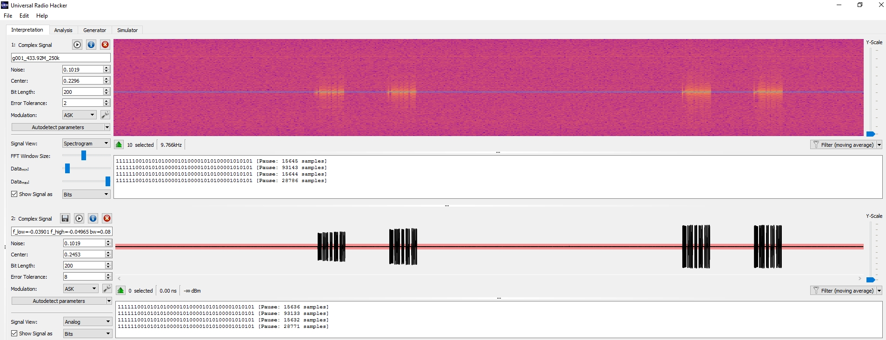

- Change Bit length to something small (10, in this case), Error Tolerance to something
  even smaller than that (1, in this case).  Click the wrench icon next to the "ASK" modulation type and make sure
  the Pause Threshold is 0 (disabled).  Zoom in on part of the signal.

- Select a chunk of the "1" and "0" symbol bits to select several whole symbols.  Here is a section of what looks like exactly 6 symbols
  in the signal.

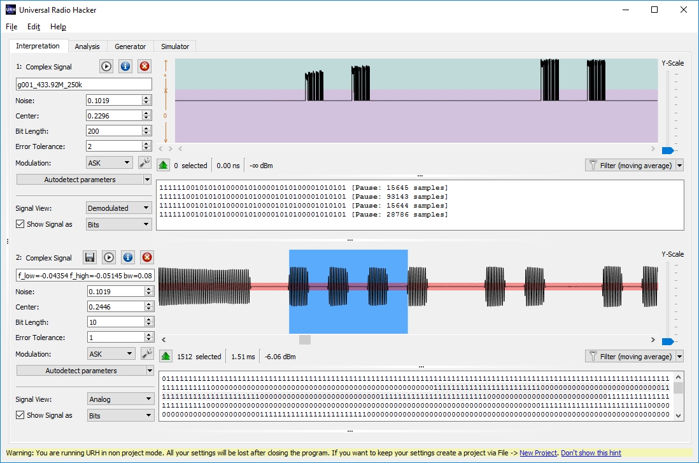

- The display says this is "1512" samples in length.  Divide by 6 (the number of whole symbols selected) to get a symbol Bit Length of "252".
  Put "252" into the Bit Length field and set the Error Tolerance to a small percentage of this at (10, in this case).

- Click the wrench icon and change the Pause Threshold to 4 so that URH will break apart signal frames when there
  are big groups of "0" symbols.

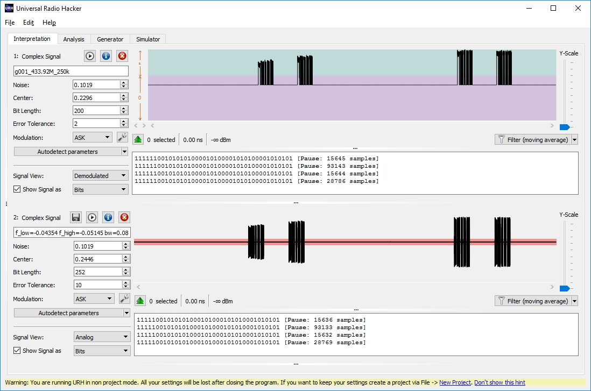

- The signal seems to contain frames with a symbol pattern of 38 symbols: "11111001010101000101000101010001010101".

- To decode that pattern, click on the Analysis tab in URH and make sure only that signal is checked in the Group.

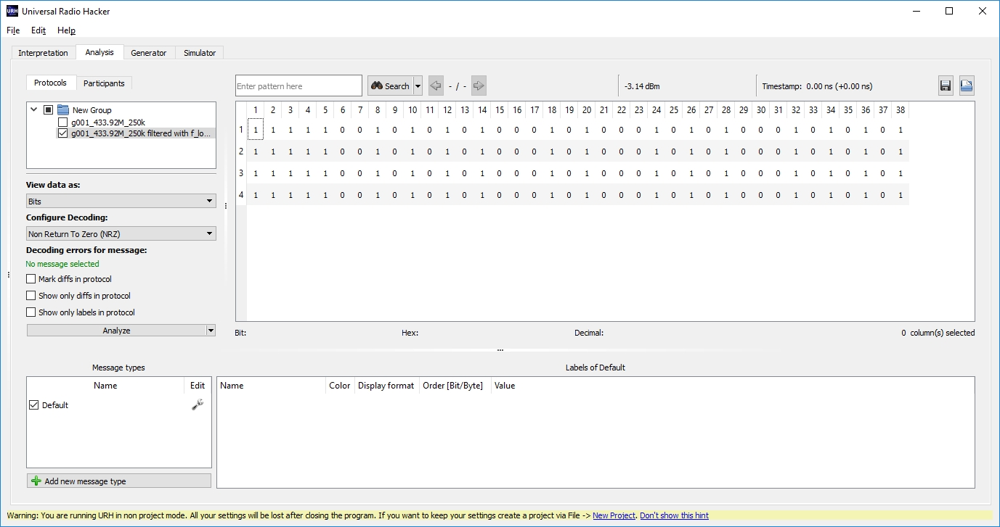

- Visually, the symbol pattern looks like symbols "11111001" as a prefix, and the data looks like a 0 bit when a symbol pattern of "01"
  appears, and a 1 bit for a symbol pattern of "0001".  This is just an educated guess by visually looking for patterns in the data and
  may take a little practice and experimentation for other signals.

- Change the Configure Decoding to "..." to bring up the dialog to create a new decoding.  Drag the "Cut before/after" function
  into the Decoder panel and set it to "Cut before" position "8" (to remove the "11111001" prefix pattern).

- Drag the "Invert" function to the next position in the Decoder panel to invert the bits.  This is in preparation to decode with the "Morse Code"
  function.  "Morse Code" works on lengths of "1" bits instead of the "0" bits we have, so inverting the symbols first will prepare for this.

- Drag the "Morse Code" function to the Decoder panel and configured it so the "Maximum length of 1-sequence for: Low" is "1"
  and the "Minimum length of 1-sequence for: High" is "3".

- Use "Save as..." to name this decoding as "My_Decoding_Invert_Morse" and close the Decoding editor window.

- Select this decoding and make sure it is applied to the frame patterns to the right.

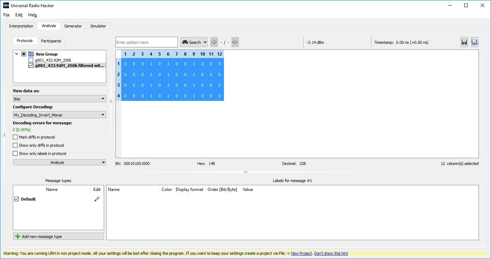

- URH shows that the resulting data message is "000101001000" or `0x148` in hex.

### Decoding in [rtl_433](https://github.com/merbanan/rtl_433) (using a build as of 2019-01-22)

- Take a look at the output of the `rtl_433 -X help` command for reference:

```
Use -X <spec> to add a flexible general purpose decoder.

<spec> is "key=value[,key=value...]"
Common keys are:
        name=<name> (or: n=<name>)
        modulation=<modulation> (or: m=<modulation>)
        short=<short> (or: s=<short>)
        long=<long> (or: l=<long>)
        sync=<sync> (or: y=<sync>)
        reset=<reset> (or: r=<reset>)
        gap=<gap> (or: g=<gap>)
        tolerance=<tolerance> (or: t=<tolerance>)
where:
<name> can be any descriptive name tag you need in the output
<modulation> is one of:
        OOK_MC_ZEROBIT :  Manchester Code with fixed leading zero bit
        OOK_PCM :         Pulse Code Modulation (RZ or NRZ)
        OOK_PPM :         Pulse Position Modulation
        OOK_PWM :         Pulse Width Modulation
        OOK_DMC :         Differential Manchester Code
        OOK_PIWM_RAW :    Raw Pulse Interval and Width Modulation
        OOK_PIWM_DC :     Differential Pulse Interval and Width Modulation
        OOK_MC_OSV1 :     Manchester Code for OSv1 devices
        FSK_PCM :         FSK Pulse Code Modulation
        FSK_PWM :         FSK Pulse Width Modulation
        FSK_MC_ZEROBIT :  Manchester Code with fixed leading zero bit
<short>, <long>, <sync>, and <reset> are the timings for the decoder in ┬╡s
PCM     short: Nominal width of pulse [us]
         long: Nominal width of bit period [us]
PPM     short: Nominal width of '0' gap [us]
         long: Nominal width of '1' gap [us]
PWM     short: Nominal width of '1' pulse [us]
         long: Nominal width of '0' pulse [us]
         sync: Nominal width of sync pulse [us] (optional)
          gap: Maximum gap size before new row of bits [us]
    tolerance: Maximum pulse deviation [us] (optional)
        reset: Maximum gap size before End Of Message [us].
Available options are:
        bits=<n> : only match if at least one row has <n> bits
        rows=<n> : only match if there are <n> rows
        repeats=<n> : only match if some row is repeated <n> times
                use opt>=n to match at least <n> and opt<=n to match at most <n>
        invert : invert all bits
        reflect : reflect each byte (MSB first to MSB last)
        match=<bits> : only match if the <bits> are found
        preamble=<bits> : match and align at the <bits> preamble
                <bits> is a row spec of {<bit count>}<bits as hex number>
        countonly : suppress detailed row output

E.g. -X "n=doorbell,m=OOK_PWM,s=400,l=800,r=7000,g=1000,match={24}0xa9878c,repeats>=3"
```

- The modulation of our signal example is "OOK_PPM" (Pulse Position Modulation) because 
  data bits seem to be encoded as the length of signal gaps (the "0" signals) between 
  signal pulses (the "1" signals).

- From the previous analysis in URH, those pulses are 252 samples long.  That file contains samples
  at "250k" samples per second, according to the filename.  So the duration of each symbol of
  a pulse or gap is about 1008 microseconds (μs) in duration in our example.

- OOK_PPM needs to know the "Nominal width of '0' gap [us]".  Based on our signal as seen in URH,
  a 0 data bit is a "0" signal (a gap) only one symbol in duration (1008μs) before a pulse 
  (a "1" symbol).  At this point, our Flex specification begins to look like this:

  `n=SAMPLE1,m=OOK_PPM,s=1008`

- OOK_PPM needs to know the "Nominal width of '1' gap [us]".  Based on our signal as seen in URH,
  a 1 data bit is a "0" signal (a gap) three symbols in duration (3024μs) before a pulse 
  (a "1" symbol).  So now, we have:

  `n=SAMPLE1,m=OOK_PPM,s=1008,l=3024`

- OOK_PPM also needs to know the reset duration.  Any gap in our signal longer than 3 symbols in
  duration is outside the frame data, so round that up a bit and estimate 3200μs.

  `n=SAMPLE1,m=OOK_PPM,s=1008,l=3024,r=3200`

- Give that a try on our signal:

  `rtl_433 -R 0 -r g001_433.92M_250k.complex16u -X n=SAMPLE1,m=OOK_PPM,s=1008,l=3024,r=3200`

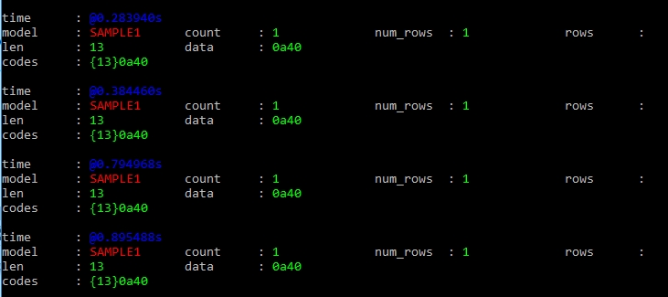

- Looks pretty good.  However rtl_433 is trying to decode the prefix instead of ignoring it.  
  And it seems like it's looking at the initial "11111001" symbol string and decoding the "001" 
  as a "0" bit.  My assumption is that it's applying an overly generous default value of tolerance 
  to the long and short gap durations we've specified, and deciding that the "001" looks like a "0" bit.
  Let's specify a tighter tolerance of 100μs and see what happens.

  `rtl_433 -R 0 -r g001_433.92M_250k.complex16u -X n=SAMPLE1,m=OOK_PPM,s=1008,l=3024,r=3200,t=100`

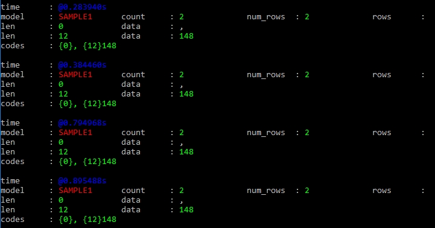

- Looks great!  rtl_433 doesn't seem to decode this signal by default, though.  `rtl_433 -G -r g001_433.92M_250k.complex16u` doesn't give us any result.
  Without more data points, it's hard to say if the device that sent this signal varies the signal at all or what this signal might mean.


## [g002_433.92M_250k.complex16u](g002_433.92M_250k.complex16u)

- Use the same process as before.  It looks like a very similar signal.  URH decodes it to these symbols:

```
1111100101000100010001010001010100010001010001 [Pause: 13118 samples]
1111100101000100010001010001010100010001010001 [Pause: 155931 samples]
11111001010101000101000101010001010101 [Pause: 15637 samples]
11111001010101000101000101010001010101 [Pause: 28777 samples]
```

- Apply the same decoder in the Analysis tab to get this data:

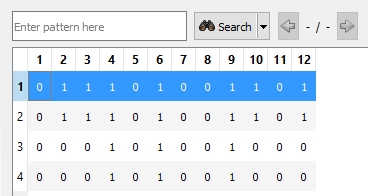

- The first two frames decode to `0x74d` and the last two decode to `0x148` so maybe the device does vary the signal based on something.

- `rtl_433 -R 0 -r g002_433.92M_250k.complex16u -X n=SAMPLE1,m=OOK_PPM,s=1008,l=3024,r=3200,t=100`

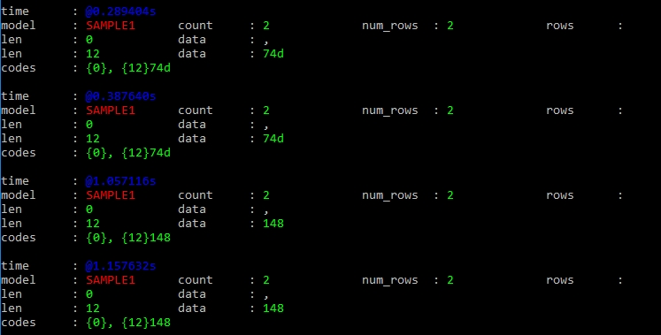

## [g003_433.92M_250k.complex16u](g003_433.92M_250k.complex16u)

- This looks like the same kind of signal.  It has `0x74d` data frames.

- `rtl_433 -R 0 -r g003_433.92M_250k.complex16u -X n=SAMPLE1,m=OOK_PPM,s=1008,l=3024,r=3200,t=100`

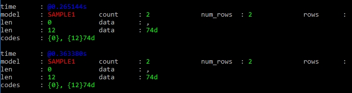

## [g025_433.92M_250k.complex16u](g025_433.92M_250k.complex16u)

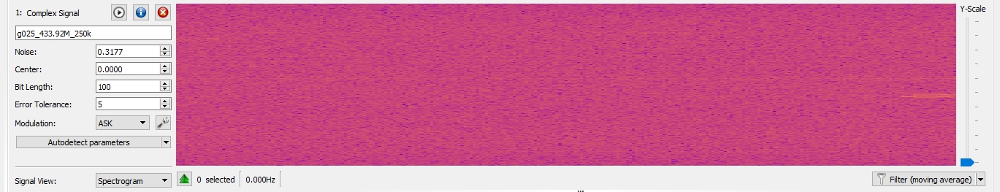

- This looks like a weak and truncated signal.  I wouldn't bother with it.

## [g026_433.92M_250k.complex16u](g026_433.92M_250k.complex16u)

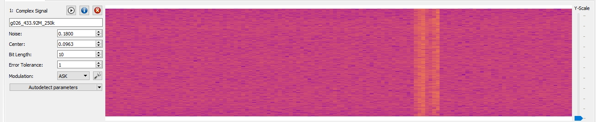

- It looks like noise.  Next...

## [g027_433.92M_250k.complex16u](g027_433.92M_250k.complex16u)

- It looks like almost the same signal as our very first sample file.  `rtl_433 -R 0 -r g027_433.92M_250k.complex16u -X n=SAMPLE1,m=OOK_PPM,s=1008,l=3024,r=3200,t=100` gives us "0x148" data frames.

## [g028_433.92M_250k.complex16u](g028_433.92M_250k.complex16u)

- `rtl_433 -R 0 -r g028_433.92M_250k.complex16u -X n=SAMPLE1,m=OOK_PPM,s=1008,l=3024,r=3200,t=100` gives us "0x148" data frames.

## [g029_433.92M_250k.complex16u](g029_433.92M_250k.complex16u)

- `rtl_433 -R 0 -r g028_433.92M_250k.complex16u -X n=SAMPLE1,m=OOK_PPM,s=1008,l=3024,r=3200,t=100` gives us "0x74d" data frames.
